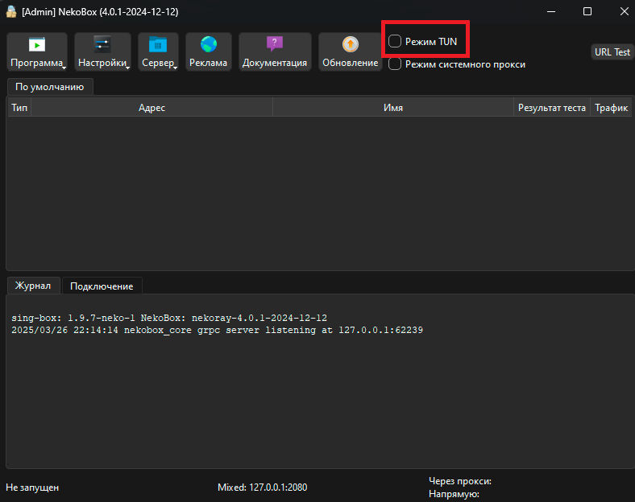
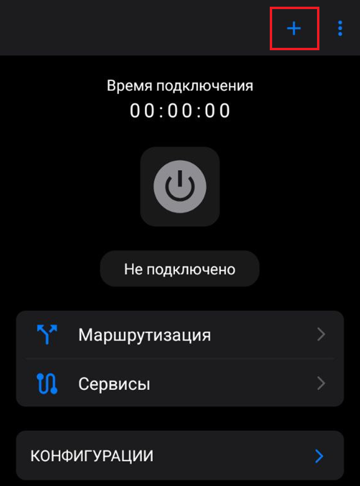
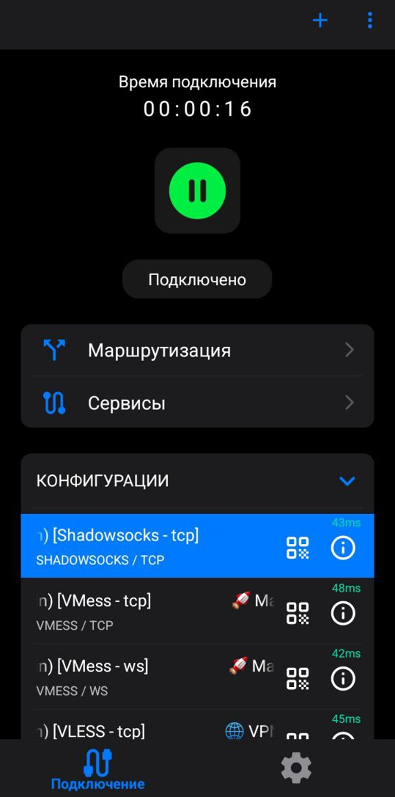
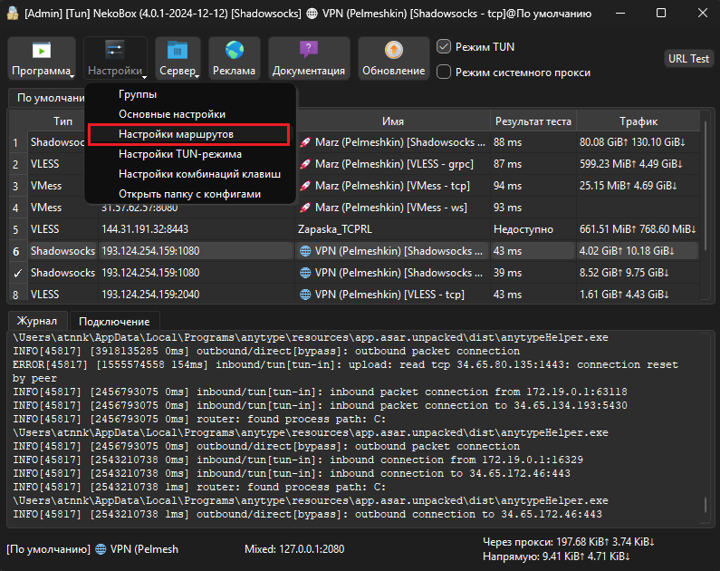
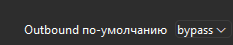
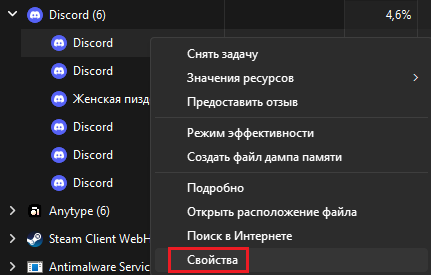
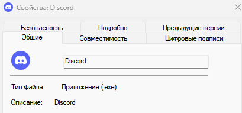

# Полный гайд по впну   
# 1 — Начальное добавление
   
## 1.1 — Рекомендуемые клиенты   
Для начала нам нужен клиент для добавления впна, для разных устройств они разные, ниже будут все рекомендуемые мной клиенты, возможно использование альтернативных, всё на ваш вкус.   
***PC(Windows):***   
1. [Nekobox](https://github.com/MatsuriDayo/nekoray/releases/download/4.0.1/nekoray-4.0.1-2024-12-12-windows64.zip) — Самый удобный в плане настройки, но визуал сложноватый, ниже будет основным для примера.   
2. [Hiddify](https://github.com/hiddify/hiddify-app/releases/latest/download/Hiddify-Windows-Setup-x64.Msix) — Удобен в плане интерфейса, но работает не всегда стабильно.   
   
Возможно использование: V2ray   
**Android:**   
1. [V2rayTun](https://play.google.com/store/apps/details?id=com.v2raytun.android) — Качать с плей маркета(который сейчас гугл плей, лучший клиент на данный момент, работает идеально на всех андроид-телефонах(из наблюдаемых мной).   
2. [Nekobox](https://github.com/MatsuriDayo/NekoBoxForAndroid/releases/download/1.4.1/NekoBox-1.4.1-arm64-v8a.apk) — Андроид-версия лучшего клиента для пк, на телефоне работает хуже чем v2ray, но вариант в целом возможный для использования.   
   
**IOS:**   
1. [Streisand](https://apps.apple.com/us/app/streisand/id6450534064) — Единственный стабильно рабочий и скачиваемый с офф. источников из того, что я нашёл, советую, инфы про него будет меньше всего ибо айфона под рукой нету.   
   
Возможно использование: Foxray, ShadowRocket   
## 1.2 — Добавление конфигов   
> Nekobox(PC)   

    
    
Ваша задача - Вставить конфиг в программу(при помощи Ctrl+v) прям в главное окно, ничего дополнительно не нужно. После появления конфигов нужно нажать галочку **"Режим TUN" **(обязательно), после этого нажав пкм по конфигу нажимаем **"Запустить". **Дополнительная настройка далее   
> V2rayTun   

    
Изначально копируем конфиги, после заходим в приложение, нажимаем плюсик, и **"Импорт из буфера обмена"**   
Нажимаем на любой конфиг(предварительно советую проверить, нажав на троеточие справа сверху и "Время отклика конфигов", выбираем лучший по задержке). Нажимаем по конфигу, а после на огромную кнопку включения, Готово   
    
Гайда для айфонов не будет, ориентируйтесь на андроид-гайд   
В целом уже работает, дальше мои личные советы
   
# 2 —  Дополнительные настройки    
В основном речь пойдёт про настройку того, на что работает впн, чтобы не уменьшать пинг в играх, или не впнить сервисы, которые это не любят(например госуслуги)   
> Nekobox(PC)   

    
Нажимаем **"Настройки" → "Настройки маршрутов" **, далее выбираем вкладку **"Базовые маршруты"** , далее справа снизу выбираем "Outbound по умолчанию" - bypass   
    
Там-же нажимаем кнопку ***"Кастомные маршруты"**  *  слева снизу, в левое поле(редактор JSON) добавляем следующее:   
```
{
    "rules": [
        {
            "domain_suffix": [
                ".ru"
            ],
            "outbound": "direct"
        }
    ]
}

```
Эта настройка позволит не распространять впн на .ru домены(то есть русские сайты)   
Далее в настройках выбираем **"Настройки TUN"**, нажимаем галочку **"Режим белого списка"**      
В поле "Проксировать процессы" и будут те приложения, на которые распространяется впн   
    
Как понять что вписывать в правую колонку?
Запускаем нужное нам приложение, потом диспетчер задач(Ctrl+alt+delete, и нажимаете "диспетчер задач")   
Потом ищем нужное нам приложение(там есть поиск сверху)   
Находим нужный процесс, нажимаем ПКМ, свойства(если горит серым, то разверните(нажав > слева, нажимаете на подпроцесс и пкм → свойства по любому из них)    
    
   
    
Копируете название и добавляете .exe   
> V2RayTun(android)   

Заходим во вкладку **"Сервисы"** и нажимаем нужные галочки, больше в целом ничего не требуется   
   
